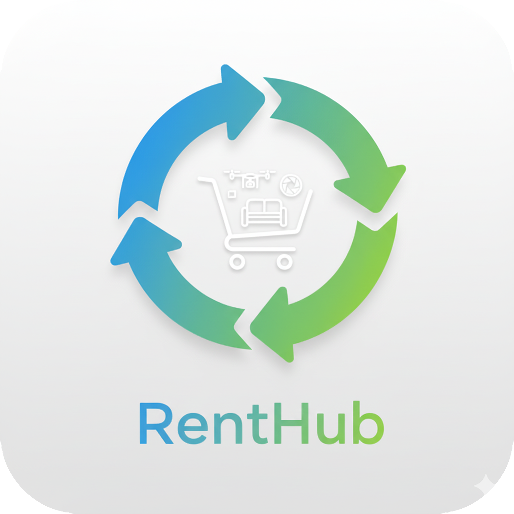

echo "# 🛒 RentHub - Flutter E-commerce Rental Application

## 📋 Project Overview
**RentHub** is a comprehensive e-commerce rental marketplace built with **Flutter** for the **Veloria Tech Flutter Developer Internship Assignment**. The application provides users with an intuitive platform to browse, rent, and manage various products across multiple categories.

## ✨ Key Features

### 🏠 Home Screen
- Smart search functionality
- Category filtering (All, Electronics, Home Goods, Sports)  
- Featured items showcase with stunning visuals
- Popular rentals grid with optimized layout
- Seamless bottom navigation

### 📱 Product Details
- High-quality product image carousel
- Comprehensive product specifications
- Flexible rental period options (Daily/Weekly/Monthly)
- Related product recommendations
- Instant booking functionality

### 📋 Order Management  
- Active and completed order tracking
- Detailed order history
- Real-time status updates
- Order timeline visualization

### 👤 User Profile
- Personal information management
- Account preferences and settings
- Support center integration
- Professional user experience

## 🛠️ Technical Stack
- **Framework:** Flutter 3.0+
- **Language:** Dart 3.0+
- **State Management:** Provider Pattern
- **UI Design:** Material Design 3
- **Platform:** Cross-platform (Web optimized)

## 🚀 Installation

\`\`\`bash
# Clone the repository
git clone https://github.com/alkazim/Rent-Hub.git
cd Rent-Hub

# Install dependencies  
flutter pub get

# Run the application
flutter run -d chrome --web-port 8080
\`\`\`

## 📂 Project Structure
\`\`\`
lib/
├── main.dart                 # Application entry point
├── models/                   # Data models
│   ├── product.dart
│   └── order.dart
├── providers/                # State management
│   └── app_provider.dart
├── screens/                  # Application screens  
│   ├── home_screen.dart
│   ├── product_detail_screen.dart
│   ├── orders_screen.dart
│   ├── order_tracking_screen.dart
│   └── profile_screen.dart
├── widgets/                  # Reusable components
│   └── bottom_navigation.dart
└── assets/                   # Images and resources
    ├── Smart Kitchen Set.png
    ├── Canon Camera.png
    ├── DJI Drone.png
    ├── Bose_Headphones.png
    └── rent_hub_icon.png
\`\`\`

## 🎯 Assignment Compliance
✅ **Complete Flutter Implementation**  
✅ **Pixel-perfect Figma Design Match**  
✅ **Multiple Functional Screens**  
✅ **Provider State Management**  
✅ **Responsive Cross-platform Design**  
✅ **Professional App Icon Integration**  
✅ **Clean Code Architecture**  

## 📱 Demo
- **Local Demo:** \`flutter run -d chrome --web-port 8080\`
- **Live URL:** [Your deployed URL if applicable]

## 👨‍💻 Developer Information
**Developer:** Alkazim  
**Assignment:** Flutter Developer Internship  
**Company:** Veloria Tech  
**Completion Date:** September 2025

## 📄 License
This project is developed for educational and internship assignment purposes.

---
*Built with ❤️ using Flutter for Veloria Tech Internship Assignment*" > README.md
